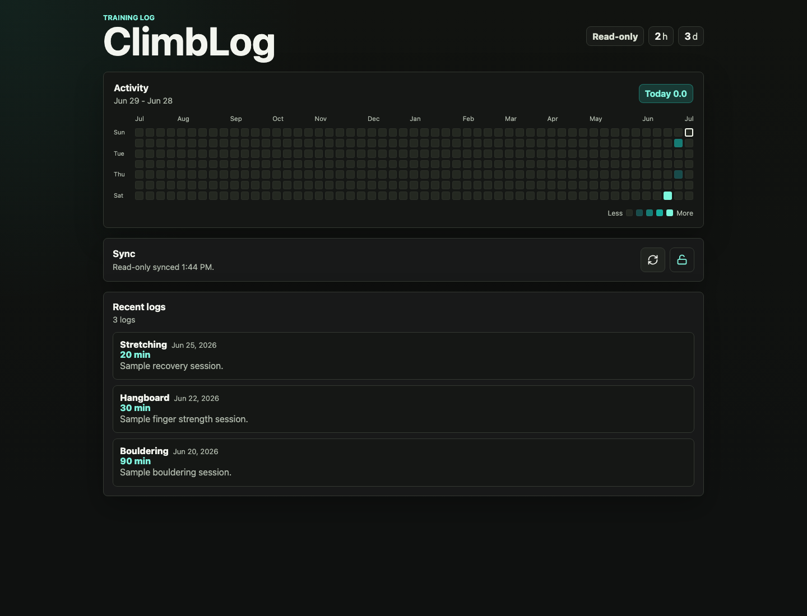

<p align="center">
  
</p>

# ClimbLog

ClimbLog is a tiny installable web app for logging climbing training and showing a widget-style activity heatmap.

Live demo:

```text
https://sooahnshin.github.io/climblog/
```



It is built as a static PWA with a minimal sync backend:

- Anyone with the app URL can read the heatmap and logs.
- Only the owner can add, edit, delete, import, or sync logs.
- Owner access is controlled by one long write token stored as a Cloudflare Worker secret.
- There are no user accounts, no build pipeline, and no server-rendered app.

## What It Does

- Log daily training by date, activity type, duration, and notes.
- Show a 12-month activity heatmap.
- Show recent log history.
- Export and import JSON backups.
- Install to a phone home screen as a PWA.
- Sync between owner devices, such as a phone and Mac.
- Let public visitors read the heatmap/logs without being able to write.

## How The Pieces Connect

```text
Git repo:
  app/template code only

GitHub Pages:
  static frontend files only

Cloudflare Worker:
  tiny API at /logs
  GET is public
  PUT requires owner token

Cloudflare KV:
  actual shared training logs

Cloudflare Worker secret:
  owner write token

Your phone/Mac browser:
  saved owner token + local cache
```

The deployed frontend cannot write to GitHub Pages. When a visitor opens ClimbLog, the browser loads static files from GitHub Pages and fetches shared logs from the Cloudflare Worker. When the owner writes a log, the browser sends the owner token to the Worker, and the Worker writes the merged log document to Cloudflare KV.

## Data And Permissions

Shared logs are stored in Cloudflare KV under:

```text
logs.v1
```

The browser also keeps a local cache and saved owner token:

```text
climblog.logs.v1
climblog.ownerToken.v1
```

The repo should not contain:

- real training logs
- backup JSON files with real data
- Cloudflare account secrets
- the owner write token

The public API URL is not a write secret because public read is intentional, but it can reveal which Worker serves the shared logs. This public example points `config.js` at a sample Worker/KV endpoint with generic seed data. Use your own Worker URL for your own logs. The write token remains the write boundary.

## Files

- `index.html` - app shell
- `styles.css` - layout, heatmap, owner mode, and controls
- `app.js` - logging, heatmap scoring, local cache, backup import/export, and sync
- `config.js` - checked-in frontend sync config; points to the live sample endpoint
- `config.example.js` - placeholder config for template users
- `worker/worker.js` - public-read / owner-write Cloudflare Worker API
- `worker/wrangler.example.toml` - example Worker deployment config
- `manifest.webmanifest` - install metadata
- `service-worker.js` - offline app shell cache
- `icons/` - PWA icons

## Local Development

Open `index.html` directly for quick UI checks. Without an API URL in `config.js`, the app runs in local-only mode.

For PWA and service worker checks, serve the folder over HTTP:

```sh
python3 -m http.server 4173
```

Then open:

```text
http://127.0.0.1:4173/
```

## Install On iPhone

Open the ClimbLog URL in Safari on iPhone:

```text
https://sooahnshin.github.io/climblog/
```

Then tap Share, choose `Add to Home Screen`, and tap `Add`. ClimbLog will open like a standalone app from the home screen.

## Create Your Own

To fork or clone this into your own ClimbLog instance, read [CREATE_YOUR_OWN.md](./CREATE_YOUR_OWN.md).

High-level setup:

1. Create your own Cloudflare KV namespace.
2. Deploy `worker/worker.js` with a `CLIMBLOG_KV` binding.
3. Store your owner write token as the `CLIMBLOG_WRITE_TOKEN` Worker secret.
4. Set your Worker URL in your deployment's `config.js`.
5. Deploy the static frontend with GitHub Pages.
6. Click the unlock icon (`Unlock owner`) on your phone/Mac with the same token.

If you clone a public copy of this repo, copy `config.example.js` to `config.js` and replace the placeholder with your own Worker URL before deploying. The checked-in `config.js` points at the sample endpoint so the demo works immediately, but your own deployment should use your own Worker/KV pair.

## GitHub Pages

Serve this repo from `main` and `/ (root)` in GitHub Pages settings. The app uses relative paths, so it works under a project URL such as:

```text
https://<github-username>.github.io/climblog/
```

## Acknowledgments

ClimbLog was inspired by [sou412/ClimbTrack](https://github.com/sou412/ClimbTrack).
